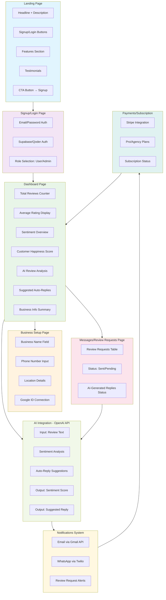

```mermaid
graph TD
    A[Landing Page] --> B[Signup/Login Page]
    B --> C[Dashboard Page]
    C --> D[Business Setup Page]
    C --> E[Messages/Review Requests Page]
    C --> F[AI Analysis Integration]
    E --> F
    F --> G[Notifications System]
    G --> H[Payments/Subscription]
    H --> C

    style A fill:#e1f5fe
    style B fill:#f3e5f5
    style C fill:#e8f5e8
    style D fill:#fff3e0
    style E fill:#fce4ec
    style F fill:#f1f8e9
    style G fill:#fff8e1
    style H fill:#e0f2f1

    %% Landing Page Details
    subgraph A[Landing Page]
        A1[Headline + Description]
        A2[Signup/Login Buttons]
        A3[Features Section]
        A4[Testimonials]
        A5[CTA Button → Signup]
    end

    %% Signup/Login Page Details
    subgraph B[Signup/Login Page]
        B1[Email/Password Auth]
        B2[Supabase/Qoder Auth]
        B3[Role Selection: User/Admin]
    end

    %% Dashboard Page Details
    subgraph C[Dashboard Page]
        C1[Total Reviews Counter]
        C2[Average Rating Display]
        C3[Sentiment Overview]
        C4[Customer Happiness Score]
        C5[AI Review Analysis]
        C6[Suggested Auto-Replies]
        C7[Business Info Summary]
    end

    %% Business Setup Page Details
    subgraph D[Business Setup Page]
        D1[Business Name Field]
        D2[Phone Number Input]
        D3[Location Details]
        D4[Google ID Connection]
    end

    %% Messages/Review Requests Page Details
    subgraph E[Messages/Review Requests Page]
        E1[Review Requests Table]
        E2[Status: Sent/Pending]
        E3[AI-Generated Replies Status]
    end

    %% AI Integration Details
    subgraph F[AI Integration - OpenAI API]
        F1[Input: Review Text]
        F2[Sentiment Analysis]
        F3[Auto-Reply Suggestions]
        F4[Output: Sentiment Score]
        F5[Output: Suggested Reply]
    end

    %% Notifications Details
    subgraph G[Notifications System]
        G1[Email via Gmail API]
        G2[WhatsApp via Twilio]
        G3[Review Request Alerts]
    end

    %% Payments/Subscription Details
    subgraph H[Payments/Subscription]
        H1[Stripe Integration]
        H2[Pro/Agency Plans]
        H3[Subscription Status]
    end
```