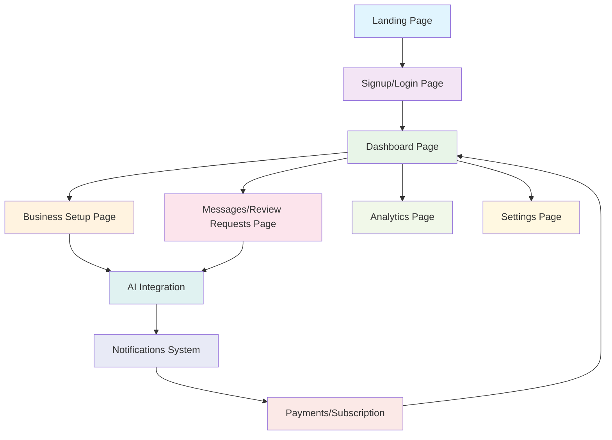
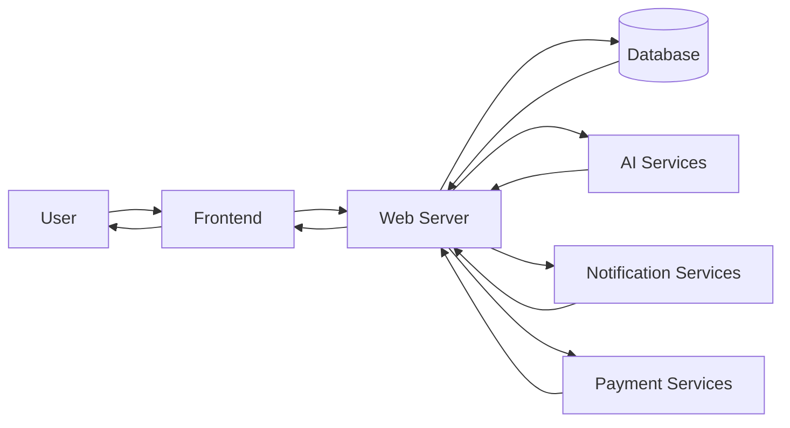
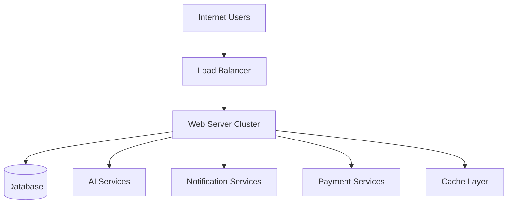

# Application Architecture

## User Flow Diagram



## Component Architecture

### Frontend Components

1. **Landing Page** (`public/index.html`)
   - Hero section with headline and description
   - Navigation to signup/login
   - Features showcase
   - Testimonials
   - Call-to-action

2. **Authentication Pages** (`public/signup.html`, `public/login.html`)
   - Email/password forms
   - Social login options
   - Role selection

3. **Dashboard** (`public/dashboard.html`)
   - Review metrics overview
   - AI analysis display
   - Business information summary

4. **Business Setup** (`public/business.html`)
   - Business information form
   - Platform connection interface

5. **Review Management** (`public/reviews.html`)
   - Review requests table
   - AI reply suggestions
   - Status tracking

6. **Analytics** (`public/analytics.html`)
   - Performance charts
   - Sentiment analysis
   - Detailed reports

7. **Settings** (`public/settings.html`)
   - Profile management
   - Notification preferences
   - Security settings
   - Subscription management

### Backend Components

1. **Web Server** (`server.js`)
   - Static file serving
   - Request routing
   - Error handling

2. **API Layer** (to be implemented)
   - Authentication endpoints
   - Business data management
   - Review processing
   - Analytics data retrieval

### External Integrations

1. **Authentication**
   - Supabase Auth
   - Qoder Auth

2. **AI Services**
   - OpenAI API for sentiment analysis
   - Auto-reply generation

3. **Notification Services**
   - Gmail API for email notifications
   - Twilio for WhatsApp notifications

4. **Payment Processing**
   - Stripe for subscription management

## Data Flow



## File Structure

```
.
├── public/
│   ├── index.html          # Landing page
│   ├── login.html          # Login page
│   ├── signup.html         # Signup page
│   ├── dashboard.html      # Main dashboard
│   ├── business.html       # Business setup
│   ├── reviews.html        # Review requests management
│   ├── analytics.html      # Analytics and reports
│   ├── settings.html       # Account settings
│   ├── 404.html            # Error page
│   ├── css/
│   │   ├── style.css       # Main styles
│   │   ├── auth.css        # Authentication styles
│   │   └── dashboard.css   # Dashboard styles
│   └── js/
│       ├── main.js         # Landing page scripts
│       ├── auth.js         # Authentication scripts
│       ├── dashboard.js    # Dashboard scripts
│       ├── business.js     # Business setup scripts
│       ├── reviews.js      # Review management scripts
│       ├── analytics.js    # Analytics scripts
│       └── settings.js     # Settings scripts
├── server.js               # Node.js server
├── package.json            # Project configuration
└── README.md               # Documentation
```

## Technology Stack

- **Frontend**: HTML5, CSS3, Vanilla JavaScript
- **Backend**: Node.js
- **Server**: Built-in HTTP module
- **Styling**: Custom CSS with responsive design
- **Routing**: File-based routing through Node.js server
- **State Management**: Client-side JavaScript

## Deployment Architecture

